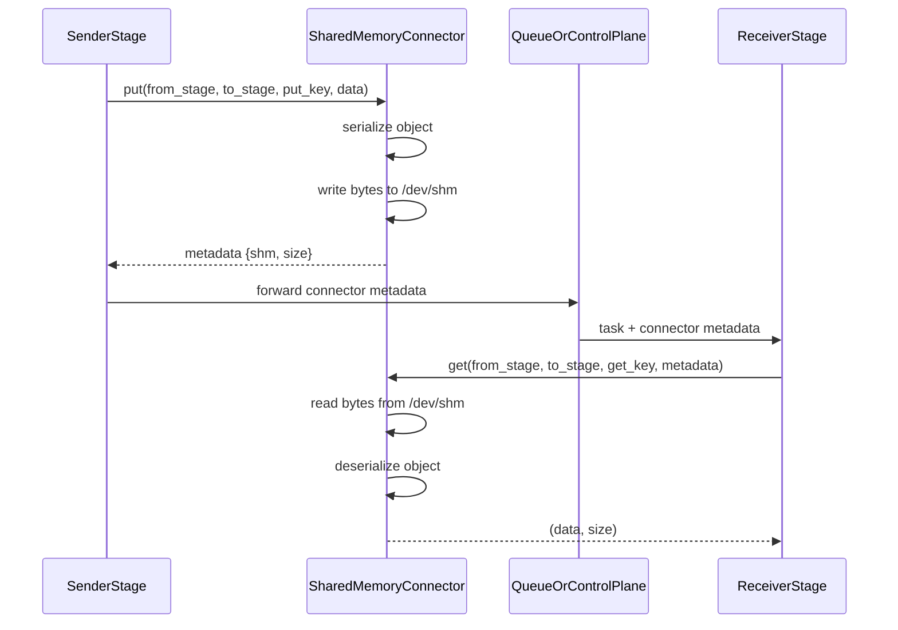

# SharedMemoryConnector

## When to Use

Best for single-node deployments where stages run on the same host. It is
auto-configured when no explicit connector is specified for an edge.

## How It Works

By default, payloads are serialized and stored in shared memory (`/dev/shm`).
An opt-in tensor format stores a serialized structural header followed by
individually aligned raw CPU tensor buffers. The segment name is returned in
metadata in both modes.

## Configuration

```yaml
runtime:
  connectors:
    connector_of_shared_memory:
      name: SharedMemoryConnector
      extra:
        raw_tensor_shm: true
        shm_event_notifications: true
        shm_notification_namespace: unique-service-name
```

## Notes

- Auto-mode uses SharedMemoryConnector if no connector is declared for an edge.
- Raw tensor storage and event notification are opt-in compatibility-preserving
  features. Use a unique notification namespace for every service on a host.

---

## Design

### 1. Overview

`SharedMemoryConnector` is the default same-node connector in `vllm_omni/distributed/omni_connectors`. It is designed for stage-to-stage transfer when producer and consumer processes run on the same host and can share `/dev/shm`.

The connector provides a unified `put()` / `get()` API for arbitrary Python objects while keeping the control plane lightweight:

- The payload is serialized, or split into a structural header and raw tensor
  buffers by the connector.
- The resulting bytes are placed in shared memory.
- The queue/control plane only carries a small metadata handle.

This makes `SharedMemoryConnector` the simplest connector in the OmniConnector family and the default fallback when an edge does not explicitly configure another backend.

### 2. Relationship with the OmniConnector System

`SharedMemoryConnector` implements `OmniConnectorBase`, so it follows the same lifecycle and API contract as the other connectors:

- `put(from_stage, to_stage, put_key, data)`
- `get(from_stage, to_stage, get_key, metadata=None)`
- `cleanup(request_id)`
- `health()`
- `close()`

Within the larger system:

- `load_omni_transfer_config()` automatically fills missing edges with `SharedMemoryConnector`.
- Callers interact with the connector exclusively through the `put()` / `get()` / `cleanup()` contract — the connector does not require caller-specific logic.

Compared with the remote Mooncake-based connectors, `SharedMemoryConnector` is intentionally minimal and local-only.

### 3. Design Goals

The connector is built around the following goals:

- **Low-friction local transfer** for single-node multi-process pipelines.
- **Unified object semantics** for arbitrary Python payloads.
- **Small control-plane overhead** by passing only metadata through queues.
- **No external service dependency** beyond POSIX shared memory and local Unix sockets.

It is not intended to provide cross-node transfer or RDMA. The tensor format
avoids generic tensor serialization, but it is not device or NPU zero-copy: the
producer materializes contiguous CPU tensors and the consumer clones them into
owned CPU storage before unlinking the segment.

### 4. Core Design

#### 4.1 Serialization Model

The default path serializes a Python object through the shared Omni serializer:

```python
payload = self.serialize_obj(data)
```

This keeps the connector behavior consistent with the rest of the connector stack:

- producer code does not need connector-specific serialization logic
- consumer code receives the existing wire-equivalent object after
  deserialization (typed structs are intentionally type-erased)
- the connector can reuse the same serializer used by other backends

When `raw_tensor_shm` is enabled, tensors are replaced by indexed descriptors
inside a small serialized header. Dataclasses and `msgspec.Struct` payloads are
type-erased to dictionaries, matching the existing receiver contract. Each raw
buffer receives 64-byte alignment; the receiver validates descriptor ordering
and bounds before constructing tensors. Payloads with no tensors transparently
fall back to the default serializer.

#### 4.2 Shared Memory as the Data Plane

The default data plane uses:

- `shm_write_bytes(...)`
- `shm_read_bytes(...)`

Tensor mode creates the same kind of POSIX segment directly so it can control
header and per-buffer alignment.

The connector stores a small metadata object such as:

```python
{
    "shm": {"name": ..., "size": ...},
    "size": ...
}
```

This metadata is passed over the control plane and allows the downstream stage to locate the shared-memory segment.

#### 4.3 Locking Model

To avoid races between the producer and consumer, the connector uses a lock file per request:

```text
/dev/shm/shm_{put_key}_lockfile.lock
```

Locking is done with `fcntl.flock`:

- producer uses `LOCK_EX`
- consumer uses `LOCK_EX`

Both sides acquire an exclusive lock. This ensures that the shared-memory segment is not read while it is still being written and makes the handoff safer in a multi-process environment.

### 5. Put / Get Flow

#### 5.1 Producer Flow: `put()`

The producer-side flow is:

1. Serialize the object, or extract tensor descriptors and raw buffers when enabled.
2. Compute the payload size.
3. Acquire the per-request lock file.
4. Write the bytes into shared memory.
5. Return lightweight metadata to the caller.
6. When enabled, send a best-effort Unix datagram to the destination stage.

The returned tuple is:

```python
(success, serialized_size, metadata)
```

where `metadata` contains the shared-memory handle needed by the consumer.

#### 5.2 Consumer Flow: `get(metadata=...)`

The primary consumer path is metadata-driven:

1. Extract the shared-memory handle from `metadata`.
2. Acquire the exclusive lock.
3. Read the raw bytes from shared memory.
4. Deserialize or reconstruct the wire-equivalent Python object.
5. Remove the lock file if it still exists.

This is the path used by the current stage-to-stage connector flow.

#### 5.3 Compatibility Flow: `get(metadata=None)`

The connector also keeps a compatibility path for callers that only know the key:

1. Attempt to open the shared-memory segment by name via `SharedMemory(name=get_key)`.
2. If the segment exists and has non-zero size, acquire the exclusive lock and read the bytes.
3. Deserialize the bytes and return the object.

If the segment does not exist or any exception occurs, the call returns `None` immediately. There is no retry loop in this path -- it is a single-attempt open.

This path is mainly for older code paths and is not the preferred mode for the current connector pipeline.

### 6. Key Implementation Characteristics

#### 6.1 All Payloads Use Shared Memory

`put()` writes every serialized payload to shared memory. The connector has no
inline-payload path or size threshold.

#### 6.2 Cleanup Is Request-Aware

Successful reads unlink the segment. `cleanup(request_id)` also unlinks tracked,
unconsumed keys matching that request, and `close()` reclaims all remaining
tracked segments and lock files. Process crashes can still leave OS resources;
operators should monitor `/dev/shm` during long-session soak tests.

#### 6.3 Optional Event Notification

With `shm_event_notifications`, each receiving stage binds a nonblocking Unix
datagram socket in `/dev/shm`. A producer sends a one-byte readiness signal
after publishing its segment. Startup races and dropped datagrams retain a 1 ms
polling fallback. When notification is disabled, the adapter uses a condition
timeout rather than calling the unavailable event path in a tight loop.

`close()` closes and unlinks the stage socket as well as tracked SHM resources.

### 7. Data Flow in the Pipeline

The typical flow with `SharedMemoryConnector` is:



This is a classic split-control-plane / data-plane design, but constrained to a single host.

### 8. Strengths and Trade-offs

#### Strengths

- Very simple deployment model.
- No external service dependency.
- Fits naturally into the existing queue-driven orchestration flow.
- Good default for local multi-process pipelines.

#### Trade-offs

- Same-node only.
- Generic serialization remains for metadata and non-tensor payloads.
- Tensor mode still performs device-to-host and receiver-owned CPU copies.
- Shared memory capacity is limited by host configuration.

### 9. Summary

`SharedMemoryConnector` is the baseline local transport for the OmniConnector system. Its design is intentionally straightforward:

- serialize an object, or separate its tensor buffers from a small header
- place the bytes in shared memory with validated alignment
- pass metadata through the control plane
- optionally wake the receiving stage with a local event
- reconstruct a type-erased object on the receiving side

It plays two important roles in vLLM-Omni:

1. It is the simplest production-ready connector for same-node stage pipelines.
2. It serves as the automatic fallback connector when no explicit edge transport is configured.

Although the current implementation is deliberately minimal, it provides the foundation for reliable local connector semantics and keeps the stage communication model uniform across the system.
