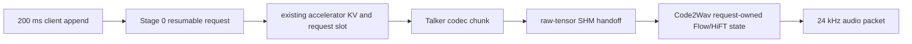

# MiniCPM-o 4.5 streaming optimization on Ascend 910C

## Scope

This document defines the performance architecture and promotion gates for
MiniCPM-o 4.5 on Atlas A3-class systems using Ascend 910C. The primary workload
is a live multimodal session: audio arrives in short increments while text and
24 kHz speech are produced continuously.

The required Daily-Omni, TTS-Seed, and Video-MME runs use the ordinary
three-stage `/v1/chat/completions` path: each sample is one serving request, and
audio *output* is chunked. Persistent 200 ms *input* appends belong to the
native-duplex demo and future serving plane. Transport, Code2Wav, graph, and
measurement changes affect the competition path; the persistent-append fast
path must be qualified separately with the realtime demo and long-session soak.

The target is not maximum offline tokens/s. A candidate wins only when it
improves the user-facing latency distribution and preserves benchmark quality:

- per-audio-chunk RTF, including first and steady-state chunks;
- text TTFT and audio TTFP at P50/P95/P99;
- long-session latency slope and interruption latency;
- request throughput under explicitly measured concurrency;
- Daily-Omni, TTS-Seed, and Video-MME accuracy, with no metric dropping more
  than 2 percentage points from its matching framework baseline.

All hardware claims in this document require measurement on the target server.
Mac/CPU tests establish software correctness only.

## What the external research changes

The useful unit of analysis is the mechanism, not the article title.

1. **Optimize persistent micro-turns, not independent requests.** Thinking
   Machines' interaction system processes 200 ms micro-turns and identifies
   frequent tiny prefill/decode overhead as a central inference problem. Its
   solution appends client chunks to a persistent accelerator-resident sequence
   and tunes kernels for the actual small shapes. The related
   [SGLang streaming-session change](https://github.com/sgl-project/sglang/pull/19171)
   reuses request/KV state, bypasses repeated prefix matching after the first
   request, restricts updates to append-only input, and gives sessions explicit
   timeout and memory-accounting semantics.
2. **Make load-induced numerical drift observable.** Batch size and request
   slicing can change reduction strategies even when each kernel is individually
   repeatable. [Defeating Nondeterminism in LLM Inference](https://thinkingmachines.ai/blog/defeating-nondeterminism-in-llm-inference/)
   motivates exact shadow comparisons across concurrency, graph, and chunking
   modes. Determinism is a debugging and attribution tool here, not a claim that
   every production Ascend kernel is already batch invariant.
3. **Separate the latency-critical loop from long work.** The
   [interaction-model architecture](https://thinkingmachines.ai/blog/interaction-models/)
   keeps a real-time model responsive while background work runs
   asynchronously. For serving, the direct inference is that audio ingest,
   first response, and steady playback need a foreground scheduling class;
   evaluation, profiling, downloads, and future long-horizon reasoning must not
   share that latency budget.
4. **Measure the deployment distribution.** The lesson from
   [on-policy distillation](https://thinkingmachines.ai/blog/on-policy-distillation/)
   is that behavior on states generated by the deployed system matters,
   especially over long trajectories. Before any future distillation or
   calibration, collect the actual chunk sizes, session ages, interruption
   points, batch widths, and error recoveries produced by this server.
5. **Match adaptation capacity to the changed behavior.**
   [LoRA Without Regret](https://thinkingmachines.ai/blog/lora/) supports using
   adequate rank and adapting all relevant layers when a model change is truly
   required. LoRA is not a substitute for serving work; it becomes relevant only
   if a semantic-preserving runtime optimization cannot meet the SLO and the
   quality gate permits an adapted checkpoint.
6. **Budget sensitivity by component.** The compositional view in
   [Modular Manifolds](https://thinkingmachines.ai/blog/modular-manifolds/)
   suggests treating numerical perturbation as a per-module budget. Quantize or
   approximate Thinker, Talker, Flow, and HiFT independently, then attribute
   their impact to the benchmark that observes that component.

The broader principle in
[The Future Worth Building Is Human](https://thinkingmachines.ai/blog/the-future-worth-building-is-human/)
reinforces the product objective: optimize the continuous interaction loop and
the user's ability to interrupt or redirect it, not a detached throughput score.

## Existing platform truth

MiniCPM-o native duplex already has one persistent-session owner. Stage 0 keeps
conversation embeddings, generated tokens, audio state, and scheduler-owned KV
state across appends. The scheduler updates a resumable request rather than
creating a new request for every audio increment. This is the correct foundation
and must remain the only session state machine.

The remaining work is to make that path cheaper and bounded:



The fast path is append-only. A mutation of earlier context, model weights,
adapter identity, or tokenizer policy must terminate/rebuild the session rather
than reuse stale accelerator state.

## Optimization plan

### 1. Persistent append fast path

Current behavior already preserves the Stage 0 request and KV state. Continue
removing work that is constant across micro-turns:

- optionally cache immutable special-token embeddings on the model device;
  keep this disabled with dynamic LoRA/adapters;
- reuse scheduler request slots, block tables, and append identities;
- do not run generic prefix/radix matching after a session is established;
- do not insert every continuation into a global prefix cache;
- retain the shipped session TTL/reaper, cancellation, pending-input limits,
  and maximum-session admission controls;
- add explicit session-held KV metrics and fair multi-session scheduling before
  calling the path production-ready beyond the current single-session default.

Append-only enforcement, cleanup, and bounded serving-side input state exist;
accelerator KV attribution and multi-session fairness remain promotion work.

### 2. Optimize real shapes

Profile these buckets separately because their winning execution policy can be
different:

| Bucket | Dominant concern | Candidate mechanism |
| --- | --- | --- |
| First audio append | TTFT / TTFP | resident session setup, small prefill graph |
| Steady 200 ms append | latency slope | cached metadata/control embeddings, fixed small-shape kernels |
| Thinker/Talker decode | ITL / codec cadence | ACL graph capture at observed batch widths |
| First Code2Wav chunk | TTFP and quality | initial codec-window sweep |
| Steady Code2Wav chunk | per-chunk RTF | exact-shape batching, CFM graph experiment |
| HiFT synthesis | underrun | fused/operator tuning only after trace attribution |

Do not infer 910C performance from CUDA. Capture P50/P95/P99 and operator traces
on the target CANN/torch-npu/vLLM-Ascend compatibility row.

### 3. Foreground scheduling

Reserve admission and execution capacity for established live sessions. New
session setup and offline/background work may use spare capacity but must not
increase established-session P99 or playback underrun. A practical scheduler
must prevent starvation in both directions and expose queue time by class.

### 4. Same-host transfer

The optional `tensor-v1` shared-memory format separates a small serialized
metadata header from aligned raw CPU tensor buffers. It now recognizes the
`msgspec.Struct` payloads used by the inter-stage wire contract and avoids a
second tensor serialization copy. Unix datagram notifications replace repeated
failed `shm_open` polling when enabled.

This is not NPU zero-copy: producing an inter-stage tensor still requires a
device-to-host transfer, and the consumer copies it into owned CPU storage
before the SHM segment is unlinked. Prove the transfer benefit with stage metrics
and an NPU trace. Use a unique notification namespace per service on a host.

### 5. NPU execution policy

- Stage 0 and Stage 1 use observed-shape ACL graph capture candidates.
- CosyVoice SDPA expands its key-padding mask to an Ascend-compatible shape.
  `auto` probes fused SDPA once and sticks to MATH after a runtime failure;
  `fused` fails closed for qualification.
- Code2Wav remains eager by default. Exact-shape CFM graph replay is an
  environment-gated experiment with static input workspaces and an LRU graph
  cache. It is promotable only after long-session cache correctness and all
  three accuracy gates pass.
- Removing host synchronization before an NPU event is TP=1 experimental work.
  Keep the conservative default for TP/HCCL until ordering is proven.

The measured CFM6 stage-2 trace makes the next implementation boundary
explicit: TransData plus Transpose consume 36.34% of device time, while host
launches are dominated by Cat/Add/Addmm/Adds. FlashAttention is only 3.69% and
Conv2D arithmetic is 3.44%. Optimize the 16-block streaming DiT as a unit:

1. define fixed/padded buckets for `(chunk_width, attention_cache_width)`;
2. keep internal-format convolution eager, because native graph capture fails
   on that operator and forcing ND format is slower;
3. capture attention, normalization, MLP, cache writes, and residual updates
   between convolution boundaries;
4. reuse graph input/output buffers without changing the public concatenated
   cache representation; and
5. reject any partition that recompiles after warmup or regresses any
   per-chunk RTF distribution.

Do not retry the measured dead ends unchanged: five CFM steps, split K/V cache
state, fused or in-place Euler expressions, full-loop TorchAir capture, or a
25/50-frame competition profile. Their controlled results are recorded in the
910C benchmark report. The chunk experiment is potentially useful for an
offline-throughput profile, but it is not eligible for the streaming
competition profile because mean and P99 per-chunk RTF regressed.

### 6. Deterministic shadow qualification

Set `VLLM_OMNI_BENCH_CAPTURE_OUTPUT_HASHES=1` to save exact whole-audio and
logical chat-delta SHA-256 fields with benchmark output. WAV hashes cover
decoded PCM; non-WAV chat hashes cover encoded audio bytes;
`/v1/audio/speech` whole-audio hashes cover raw streamed PCM. Raw speech leaves
the per-chunk hash list empty because HTTP receive boundaries can split or
coalesce independently of model output.

Run an identical prompt set and seed under concurrency 1, 2, and 4, then under
each graph/chunk candidate. Compare exact text and audio with:

```bash
python -m vllm_omni.benchmarks.determinism_gate \
  baseline.json candidate-c2.json candidate-c4.json \
  --field generated_texts \
  --field audio_content_sha256s \
  --field audio_chunk_sha256s \
  --report-json determinism-report.json
```

The gate fails on request errors, completion-count drift, missing fields,
length differences, or any exact output mismatch. An exact mismatch is not
automatically a quality failure; it is a signal to attribute the numerical
change before using the two-percentage-point aggregate allowance.

### 7. Talker repetition-frequency cache

The MiniCPM-o Talker applies a frequency-aware repetition penalty over the
last 16 codec IDs. The checkpoint-compatible implementation used
`torch.bincount` every codec step. On 910C that operator falls back to AI CPU
and synchronizes the host before the remaining sampling work can proceed.

Keep one float32 frequency vector per live request instead. Initialize it with
a broadcast equality/reduction, then add the sampled ID and subtract the ID
leaving the 16-code window with device-native equality operations. The update
is submitted before the existing sampled-scalar read, so it can overlap the
required EOS synchronization. Reset the vector on prefill and evict it with
the request RNG and decode state. This preserves the exact frequency vector,
sampling distribution, seed, EOS behavior, and 16-code history semantics.

Do not remove the sampled-scalar synchronization as part of this change. A
separate 3x32 experiment showed that eliding the read while EOS was masked
regressed median per-chunk RTF by 2.66% and E2E by 2.87%. Talker and Code2Wav
share logical NPU 1, so that synchronization also provides useful pipeline
pacing on the measured topology.

### 8. Sampling fusion requires live-dtype and service proof

The post-cache Stage-1 trace removed `Bincount` and exposed the remaining
Top-P/Top-K sampling block. A prototype using Ascend's fused
`npu_top_k_top_p` operator looked promising in an isolated FP32 benchmark, but
failed exact mask parity in 2 of 98 BF16 cases and regressed the clean 3x32
service comparison: median per-chunk RTF +8.94%, whole-audio RTF +9.17%, TTFP
+6.96%, P99 chunk RTF +6.97%, E2E +9.25%, and TTFT +2.46%. The generated
audio and chunk hashes also changed.

The prototype was removed rather than retained behind a flag. This establishes
two promotion rules for later custom sampling kernels: parity must be tested in
the model's live BF16 dtype, and a faster isolated operator is insufficient
when its stream, workspace, or synchronization behavior makes end-to-end
serving slower.

## 910C candidate profile

Use `vllm_omni/deploy/minicpmo_4_5_2npu_910c.yaml` as the candidate overlay:

```bash
npu-smi info

VLLM_OMNI_MINICPMO45_NPU_SDPA_BACKEND=auto \
vllm serve openbmb/MiniCPM-o-4_5 --omni \
  --deploy-config vllm_omni/deploy/minicpmo_4_5_2npu_910c.yaml \
  --trust-remote-code \
  --allowed-local-media-path /data/benchmarks \
  --interleave-mm-strings \
  --host 0.0.0.0 --port 8099
```

The reduced-step Code2Wav candidate is a separate, quality-gated profile:

```bash
VLLM_OMNI_MINICPMO45_NPU_SDPA_BACKEND=auto \
vllm serve openbmb/MiniCPM-o-4_5 --omni \
  --deploy-config vllm_omni/deploy/minicpmo_4_5_2npu_910c_cfm8.yaml \
  --trust-remote-code \
  --allowed-local-media-path /data/benchmarks \
  --interleave-mm-strings \
  --host 0.0.0.0 --port 8099
```

On the measured 910C host this eight-step profile improved median per-chunk
RTF by 12.72%, whole-audio RTF by 11.52%, audio TTFP by 5.34%, and E2E by
11.12% versus the accepted ten-step service. TTFT regressed 0.60%, within the
2% guard. An eight-prompt official Seed-TTS screen showed zero WER regression
and no SIM regression. Keep the profile opt-in until the full quality suites
pass; do not infer full-suite accuracy from the screen.

The more aggressive six-step profile is also explicit opt-in:

```bash
VLLM_OMNI_MINICPMO45_NPU_SDPA_BACKEND=auto \
vllm serve openbmb/MiniCPM-o-4_5 --omni \
  --deploy-config vllm_omni/deploy/minicpmo_4_5_2npu_910c_cfm6.yaml \
  --trust-remote-code \
  --allowed-local-media-path /data/benchmarks \
  --interleave-mm-strings \
  --host 0.0.0.0 --port 8099
```

Against the eight-step profile on the measured host, six steps improved median
per-chunk RTF by 9.54%, whole-audio RTF by 9.35%, audio TTFP by 8.39%, and E2E
by 8.64%; TTFT improved 0.59%. Its paired eight-prompt official Seed-TTS screen
kept WER at 0.0000 and changed WavLM SIM from 0.027103 to 0.016932, a 1.02
percentage-point drop within the 2-point allowance. This is a screen, not a
full-suite accuracy result, so the default remains ten steps.

The fixed-width DiT MLP graph profile layers on top of CFM6:

```bash
VLLM_OMNI_MINICPMO45_NPU_SDPA_BACKEND=auto \
vllm serve openbmb/MiniCPM-o-4_5 --omni \
  --deploy-config vllm_omni/deploy/minicpmo_4_5_2npu_910c_cfm6_dit_mlp_graph.yaml \
  --trust-remote-code \
  --allowed-local-media-path /data/benchmarks \
  --interleave-mm-strings \
  --host 0.0.0.0 --port 8099
```

This profile keeps attention and Conv2D eager, then replays one shared TorchAir
graph for the fixed-width post-convolution norm/MLP/residual partition across
all DiT blocks. Against a same-era CFM6 median it improved mean per-chunk RTF
by 5.25%, P99 per-chunk RTF by 2.08%, whole-audio RTF by 4.49%, audio TTFP by
1.43%, and E2E by 4.58%; TTFT regressed 0.45%, inside the 2% guard. Its paired
EN8 screen kept WER at 0.0000 and improved official WavLM SIM from 0.016932 to
0.018103. It remains opt-in pending the three full competition suites.

Opt-in experiments, one at a time:

```bash
VLLM_OMNI_MINICPMO45_NPU_CFM_GRAPH=1
VLLM_OMNI_NPU_SYNC_BEFORE_DEVICE_EVENT=0  # TP=1 only
VLLM_OMNI_MINICPMO45_CACHE_CONTROL_EMBEDDINGS=1  # native duplex, static weights only
VLLM_OMNI_NPU_PROFILER_AIC_METRICS=PipeUtilization
VLLM_OMNI_NPU_PROFILER_L2_CACHE=1
```

## Promotion ladder

1. Record hardware product/topology, CANN, NNAL, torch, torch-npu, vLLM,
   vLLM-Ascend, and vLLM-Omni revisions.
2. Establish a fresh-process baseline with checkpoint-quality chunk and
   diffusion settings.
3. Run one semantic-preserving candidate for at least three repetitions.
4. Run deterministic shadow comparison across concurrency and execution modes.
5. Run full Daily-Omni, TTS-Seed, and Video-MME evaluation with identical
   evaluated counts and the fail-closed 2-point quality gate.
6. Run a long-session soak with interruption, cancellation, and cleanup while
   observing host memory, NPU memory, `/dev/shm`, queue time, and latency slope.
7. Promote only if the target distribution improves without a new P99,
   continuity, memory, or correctness regression.

## Implementation status

| Mechanism | Status |
| --- | --- |
| Stage-separated continuous batching and request-owned audio state | Shipped |
| Stage 0 scheduler/KV continuity for native duplex | Shipped, experimental lifecycle boundary |
| Per-chunk RTF, TTFT, TTFP, continuity, and benchmark quality gates | Shipped |
| Raw-tensor SHM and event notification | Implemented, opt-in, target proof required |
| Cached immutable Stage 0 control-token embeddings | Implemented, opt-in for static weights only |
| Sticky fused-to-MATH Ascend SDPA adapter | Implemented, target proof required |
| Exact-shape CFM graph replay | Implemented, off by default; full-loop capture rejected on measured 910C |
| Exact output hash capture and deterministic JSON gate | Implemented |
| Six- and eight-step CFM deploy profiles | Implemented; CFM6 passed the full 1,088-row Seed-TTS WER/SIM gate, Daily-Omni and Video-MME pending |
| Talker sliding repetition-frequency cache | Shipped; exact parity and full 1,088-row Seed-TTS WER/SIM gate passed |
| Fused Ascend Top-P/Top-K adapter | Rejected and removed; BF16 parity drift and 6.96-9.25% serving regressions |
| Foreground/background scheduler classes | Designed, not implemented |
| Session TTL/reaper, cancellation, pending-input limits, max-session admission | Shipped |
| Per-session accelerator KV metrics and fair multi-session scheduling | Required before multi-session production promotion |
| Fixed-width DiT MLP graph partition around eager convolution | Implemented; full Seed-TTS passed, Daily-Omni and Video-MME pending |
| Broader cache-shape-bucketed DiT graph partitions | Next graph-coverage target |
| Ascend-specific DiT layout/cache kernels | Profiler-triggered fallback if partitioning cannot remove launch overhead |
| Deployment-distribution distillation/LoRA | Research fallback, not serving baseline |
